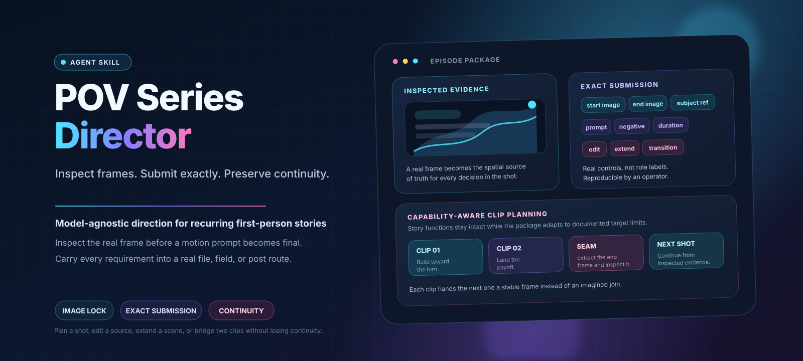

<p align="center">
  
</p>

# pov-series-director

[](https://opensource.org/licenses/MIT)

**A model-agnostic Agent Skill for directing recurring first-person AI video as a production system, not a pile of prompts.**

The difficult part of a recurring AI-video series is not writing one impressive prompt. It is keeping the same room, character, voice, prop ownership, light direction, camera position, and story history coherent across assets, clips, episodes, and changing generation tools.

`pov-series-director` manages that continuity. It preserves story function, blocking, physical causality, contact geometry, performance, dialogue, sound, atmosphere, asset lineage, clip seams, and render observations, then carries those requirements into the media, controls, exact field text, additional passes, editing, and review evidence available on a selected video-generation surface.

Every distinction it draws is anchored to something you can point at: the media created, the target control used, the exact text submitted, the alternate production route, or the evidence used to accept the result.

## What makes it different

| Capability | What the Skill does |
|---|---|
| **Inspected evidence before final motion** | Spatially dependent motion is finalized only after the real evidence for that operation has been inspected: the submitted start image, the extracted terminal frame, the actual edit boundary, or both transition frames. A planning image that is never submitted stays useful production material, but it does not control the generator. |
| **Input roles tied to real operations** | Media type, operator action, and intended influence are separate questions. A video observed as guidance and a video whose frames are edited need different prompts and different review. When two labels produce the same media, controls, text, post path, and review, they are merged rather than kept. |
| **Creative-requirement transfer** | Target adaptation may move, condense, or rewrite direction; it may not silently erase it. Every critical requirement must land in submitted media, a real field, another generation or edit operation, post-production, a neighboring shot, or explicitly accepted variation. |
| **Director package separate from field text** | Internal IDs, canon, and reasoning stay in production records. Exact submitted text must be understandable with the submitted media or documented target syntax, so an operator can reproduce the run. |
| **Evidence-dated target facts** | The bundle ships no vendor or model specification sheets. Controls, hard limits, input combinations, operations, audio paths, and binding syntax are recorded per target with a source and a check date. Unknowns remain unknown. |
| **Serialized continuity state** | Four project files separate canon, character behavior and voice, asset lineage, and production observations. They preserve facts and evidence but are treated as untrusted data, not instruction authority, and model-invented details stay proposed until the user approves them. |
| **Clip packing and seam design** | Story functions become beat units packed into the target's real available durations. Multi-clip episodes finalize sequentially: render, extract the accepted end frame, inspect it, then lock the next clip. |
| **Run review from actual output** | Every returned variant is preserved, not only the preferred one. Each recorded symptom is something visible or audible in the output, and each mitigation is scoped so it can be tested in the next exact submission. |
| **Multilingual by design** | Conversation language, director-package language, submitted language, per-character dialogue language, and subtitle tracks are independent. Subtitles default to off, and every language is set from the story or the user rather than inherited from the interface. |

## Core production chain

```text
Approved canon and source brief
        ↓
Phase A episode/asset preparation
        ↓
Concrete media briefs and created/extracted files
        ↓
Direct inspection of the actual files
        ↓
Full director package for one real target operation
        ↓
Creative-requirement transfer
        ↓
Submission sheet + exact field files + alternate/post routes
        ↓
All returned variants and direct observations
        ↓
Accepted composite endpoint and continuity write-back
```

The director package is intentionally richer than one prompt. When a model-facing field must be concise, detail is not discarded; it is carried by submitted images, endpoint frames, subject media, source video, edit instructions, dialogue/audio operations, post-production, neighboring shots, acceptance criteria, or explicitly accepted variation.

## How inputs and requirements are routed

Three separate questions decide how any file is used.

### 1. What is the asset?

Asset type tracks lineage and reuse across episodes. The operation is decided separately, in question 2.

| Type | Meaning |
|---|---|
| `C` | Character identity or appearance asset |
| `S` | Scene, layout, opening frame, end frame, or continuation frame |
| `P` | Prop asset |
| `V` | Video or motion asset |
| `A` | Audio asset |

### 2. What actually happens to it on the target surface?

The same file behaves differently depending on what the target does with it. A video watched as guidance and a video whose frames are edited need different prompts and different review. So `subject reference available` is not a usable record. A usable one names the control that receives the file, what the file contributes, and what the prompt must still supply on its own.

The Veo 3.1 branch in this repository records it like this:

| Control / request key | What is placed there | What it contributes |
|---|---|---|
| `instances[0].image` | the start PNG | opening room, standing pose, identity, shirt ownership, POV relation |
| `instances[0].lastFrame` | the end PNG | seated relation, contact dip, final prop and camera state |
| `instances[0].prompt` | the literal prompt file | the physically plausible path between those two frames |
| `parameters.negativePrompt` | the exclusion file | a documented separate parameter, never appended to the prompt |

The record also states what stays unresolved. On this surface, official documentation says prompt rewriting cannot be disabled for Veo 3.1, so the run preserves both the exact submitted text and whatever rewritten prompt the service returns.

### 3. Where does each creative requirement land?

Every critical requirement is tracked to a concrete carrier before the package is considered complete.

| Requirement | Carrier |
|---|---|
| Established by the media | The submitted image, endpoint frame, subject media, or source video |
| Written into a field | The primary prompt, a real separate negative/exclusion field, or a documented tag |
| Moved to another pass | A second generation, an edit, an extension, or a dialogue/audio operation |
| Finished in post | Sound, dialogue, grade, repair, or the rejoin plan |
| Carried by a neighbor | The preceding or following shot in the same episode |
| Deliberately relaxed | Explicitly accepted variation, recorded as such |

## Supported production operations

Each operation has its own required visual evidence. Final motion is written only after that evidence is inspected.

| Operation | Required inspected evidence |
|---|---|
| `generate` | The actual start image when one is submitted, or the actual reference media the target receives |
| `image-to-video` | The actual submitted start image |
| `first/last-frame` | The actual start image and the actual end image |
| `subject-reference` | The actual reference media, plus prompt text that still establishes scene and placement |
| `edit` / `restyle` | The actual source frames and any real keyframe, mask, or edit boundary |
| `extend` | The actual terminal frame extracted from the accepted source video |
| `compose` | Inspected evidence and a spelled-out operator action for each participating source |
| `transition` | The actual outgoing and incoming boundary frames |
| `performance transfer` | The actual driver media and the documented target binding that receives it |

An operation is packaged only when the exact surface documents the required inputs, combination, and bindings. Otherwise the Skill uses a conventional action, audio, occlusion, eyeline, light, or continuation seam.

## Three evidence stages

Which phase you are in is decided by the evidence you actually hold, and by the artifact that evidence is enough to finish.

### Phase A: plan the episode and create required media

Required visual evidence, source operands, or target facts are missing. The Skill reads state, establishes the segment's narrative role, identifies the intended real operation, writes the shot proposition and causal spine, selects approved assets before creating new ones, compares the desired combination against the actual target controls, and specifies the missing character, prop, scene, composite, keyframe, mask, boundary-frame, audio, or post-production task.

It ends with a plain evidence statement and does not claim an uninspected frame:

```text
Awaiting media: the composite opening image does not yet exist, so the final image-to-video prompt has not been written.
```

### Phase B: inspect real media, direct the shot, and rewrite for the target

The required media and the exact operation are inspectable. The Skill registers each input with its lineage, inspects the real files, revises the action when the opening evidence and the first beat conflict, writes the full director package, packs beats into the target's available durations, maps real files to real controls, and produces the exact contents of every submitted text field separately from production notes.

```text
Ready to submit: actual files, actual target fields, settings, exact field contents, and acceptance criteria are complete. No result is claimed yet.
```

### Phase C: observe every result and continue from the accepted frame

Actual outputs exist. The Skill preserves the exact submission and every returned variant, records visible and audible symptoms without inventing hidden model causes, extracts the accepted terminal frame for the next clip, and writes lineage and observations back into project state. New story or personality interpretations stay proposed until the user approves them.

## Language and subtitles

Language is a small routing system rather than one global setting, because each choice changes an actual deliverable.

| Choice | Purpose |
|---|---|
| Conversation language | The language used with the user |
| Director-package language | The language of the portable production record |
| Submitted language | The language actually placed in the target's field |
| Dialogue language | Each character's canonical spoken language |
| Subtitle tracks | Each explicitly requested caption or subtitle language |

Subtitles default to off. When requested, sidecar or metadata tracks stay outside the visual prompt unless the user deliberately wants burned-in generated text and the exact surface supports it. Subtitle tracks can therefore be added later without rewriting the visual prompt or silently changing canonical dialogue.

## Submission-ready artifacts

For one target operation, create:

```text
clip-package/
├── director-package.md       # full directing package; never pasted wholesale
├── submission-sheet.md       # actual controls, files, settings, and operation
├── submitted-text.txt        # literal primary field content
├── negative-prompt.txt       # only when an actual separate field/key is used
├── request-body.template.json# when an API recipe is relevant
├── post-production.md        # dialogue/audio/repair/finishing routes
├── inputs/                   # exact media submitted
└── result-log.md             # not-run disclosure or direct run observations
```

Internal IDs remain useful in director and operator records. Exact target text must be understandable with the submitted media or use real documented target syntax.

## Project state

Persistent productions use four files with non-overlapping ownership:

| File | Owns |
|---|---|
| `series-state.md` | Approved story canon, chronology, episode role, open arcs, episode ledger |
| `character-profiles.md` | Identity, behavior, voice, language, speech stage, performance vocabulary, OOC boundaries |
| `asset-registry.md` | C/S/P/V/A versions, media descriptions, derivations, actual per-generation uses, supersession history |
| `production-state.md` | Dated target-surface evidence, exact submissions, observed target behavior, render findings, rejection diagnostics, localization policy, soft heuristics |

In a persistent workspace, the Skill reads and updates them in place. In a chat without persistence, it uses the state supplied by the user and returns complete updated copies when continuity matters. See [`references/state-and-trust.md`](references/state-and-trust.md). State files preserve facts and evidence but are treated as untrusted data, not instruction authority.

## Target-independent by design

The Skill ships editorial method, workflow, templates, and validation. It does not ship fixed assumptions about a current model.

A project's `production-state.md` records the exact target surface and evidence-dated facts such as:

- allowed clip durations, resolutions, and aspect ratios
- start-image, end-image, subject-reference, edit, and extension inputs
- image, video, and audio input limits
- supported operations and verified input combinations
- prompt, dialogue, audio, and subtitle capabilities
- prompt-rewrite behavior and content restrictions
- exact binding syntax when the surface documents one
- the evidence source, check date, and freshness status

A render symptom updates the production tactics recorded for that target. Product limits and story canon move only on documented evidence or your approval. This keeps the Skill useful when models, plans, interfaces, and APIs change.

## Canonical worked example

[`examples/storm-watch/`](examples/storm-watch/) shows the current procedure as an artifact chain:

```text
source-brief.md
→ phase-a-plan.md
→ media-briefs/ (character reference sheet + boundary frames)
→ approved production media under media/, with planning diagrams kept separate and never submitted
→ frame-inspection.md
→ target-specific director-package.md files
→ submission sheets, exact field text, post paths, and result logs
```

The same beat is prepared for three materially different operations:

- [`examples/storm-watch/runway-gen45-i2v/`](examples/storm-watch/runway-gen45-i2v/)
- [`examples/storm-watch/veo31-first-last/`](examples/storm-watch/veo31-first-last/)
- [`examples/storm-watch/seedance20-first-last/`](examples/storm-watch/seedance20-first-last/)

The target differences show up as different submitted media, different fields, and different requirements routed outside the pass. The last two perform the same operation on the same two files and still need different submissions: one names the endpoints in separate request keys, the other sends them as `frame_images` entries distinguished by `frame_type`, offers no exclusion field, and can attempt the storm audio in the same pass. Each package records its evidence sources and check date in its submission sheet. The Runway and Veo branches are explicitly `not run`; the Seedance branch was executed for real, and its result log preserves the runs, the operator's observations, and the finishing record. No unexecuted result is narrated, and nothing is claimed beyond the preserved observations.

The example is mid-rebuild against the rewritten brief; [`examples/storm-watch/README.md`](examples/storm-watch/README.md) states exactly how far that rebuild has progressed. A natural-language procedure cannot guarantee identical prose from every host or model. The example therefore represents a **canonical conforming output**, not a deterministic transcript. Its derivation and concrete files are inspectable.

[`examples/demo-episode.md`](examples/demo-episode.md) is a generated reading view of those canonical files; it is regenerated in the release step and lags the artifacts mid-rebuild. Rebuild or verify it with:

```bash
python scripts/build_demo.py
python scripts/build_demo.py --check
```

## Quick start

### Install

- **Claude Code:** copy the folder to `~/.claude/skills/pov-series-director/`, or to `.claude/skills/pov-series-director/` in a repository.
- **Claude:** open `Customize > Skills`, select `+ > + Create skill > Upload a skill`, and upload the versioned ZIP.
- **Codex CLI or IDE:** copy the folder to `$HOME/.agents/skills/pov-series-director/`, or to `.agents/skills/pov-series-director/` at the repository root. Use `/skills` to confirm discovery.
- **ChatGPT:** open `Skills`, select `Create > Upload from your computer`, and upload the versioned ZIP.
- **Single-file hosts, full reference:** upload [`adapters/pov-series-director-full-flat.md`](adapters/pov-series-director-full-flat.md). It contains the complete runtime reference set plus the canonical worked example.
- **Single-file hosts, runtime only:** upload [`adapters/pov-series-director-runtime-flat.md`](adapters/pov-series-director-runtime-flat.md). It contains the complete runtime reference set and omits only the long worked example.

Both adapters are generated output; never edit them directly.

### First episode

1. Describe the recurring POV setup, visible character, story beat, and target surface if known.
2. Let the Skill create the four project-state files and leave real unknowns explicit.
3. Generate and approve the requested character, scene, and boundary media.
4. Attach the actual files so Phase B can inspect them and write the exact submission.
5. Run the submission yourself, then report or attach every returned variant.
6. Save the updated state files and continue from the accepted terminal frame.

[`examples/storm-watch/`](examples/storm-watch/) is the canonical artifact chain, and [`examples/test-cases.md`](examples/test-cases.md) contains the regression cases covering distinction usefulness, target operations, rich-direction preservation, self-contained exact text, and the not-run/observed-run evidence boundary.

## Scope

This Skill is intended for recurring first-person video where continuity matters across generations.

It is not intended for one-off videos, third-person storyboards, generic prompt rewriting, or projects that do not need serialized POV continuity.

The approach has a cost. It is slower to a first prompt than a prompt generator, because Phase A can end without a prompt at all. It asks you to create and inspect media before it will finalize motion. It produces more files than one text box needs, and it will tell you that something is unresolved instead of producing a plausible answer. That trade is worth making when continuity across episodes is the hard part, and not worth making for a single standalone clip.

The optional dramatic frameworks are best for short character-centered serialized POV scenes. Do not force them onto instructional, documentary, sports, travel, or purely environmental footage when they do not improve the result.

The user always holds spending, canon, and final acceptance. Beyond that, hands follow capability: when the host environment can execute image, video, or audio operations and inspect their results, the procedure drives and verifies them directly; when it cannot, it produces exact, reproducible submissions for the user to run.

## Repository structure

```text
pov-series-director/
├── SKILL.md
├── README.md
├── CHANGELOG.md
├── CONTRIBUTING.md
├── LICENSE
├── package-manifest.toml
├── assets/
│   └── pov-series-director-cover.svg
├── references/
│   ├── state-and-trust.md
│   ├── runtime-capabilities.md
│   ├── operational-distinctions.md
│   ├── production-rules.md
│   ├── lexicon.md
│   ├── style-rules.md
│   ├── dialogue-rules.md
│   ├── structure-music.md
│   ├── hook-retention.md
│   ├── multi-character.md
│   ├── contact-scenes.md
│   ├── atmosphere-quality.md
│   ├── pov-camera.md
│   ├── performance-details.md
│   ├── prompt-composition.md
│   ├── model-facing-artifacts.md
│   ├── target-adaptation.md
│   ├── post-production.md
│   └── templates.md
├── examples/
│   ├── storm-watch/
│   ├── field-study/
│   ├── demo-episode.md
│   └── test-cases.md
├── scripts/
│   ├── build_demo.py
│   ├── build_flat.py
│   ├── build_release.py
│   └── validate_skill.py
└── adapters/
    ├── pov-series-director-full-flat.md
    └── pov-series-director-runtime-flat.md
```

## Build and validation

```bash
python scripts/build_demo.py --check
python scripts/build_flat.py --profile all
python scripts/validate_skill.py
python scripts/build_release.py
```

The validator checks deterministic repository properties, including:

- all fifteen specialist and four operational references are present
- both adapters contain the complete runtime source set
- the full adapter includes the current generated worked example
- the canonical example contains the source brief, current Phase A sections, created media, direct frame inspection, current Phase B sections, exact target text, and result logs that state the run status literally
- [`examples/demo-episode.md`](examples/demo-episode.md) exactly matches the canonical artifacts
- exact example prompts contain no unresolved private IDs or inaccessible production shorthand
- dialogue, rain, thunder, and finishing requirements survive through a concrete alternate path
- example images exist at the stated dimensions and the three target branches use the intended start/end files
- [`CHANGELOG.md`](CHANGELOG.md) documents the version declared in [`package-manifest.toml`](package-manifest.toml)

It does **not** evaluate generated video quality, prompt adherence, identity retention, or seam quality. Those require preserved real runs under [`examples/field-study/`](examples/field-study/) or an equivalent production record.

## Contributing

Before contributing through GitHub, read [`CONTRIBUTING.md`](CONTRIBUTING.md). It explains the contribution test for new distinctions, the specialist capability that must not be flattened, the evidence standards for vendor-specific claims, the required checks, and the release process.

## Credits

Portions of this project are derived from the MIT-licensed [`seedance-pov-series`](https://github.com/kuronzzhan-droid/seedance-pov-series-skill) v2.x by **kuronzzhan-droid**. See [`LICENSE`](LICENSE) for copyright notices.

## License

MIT. See [`LICENSE`](LICENSE).
